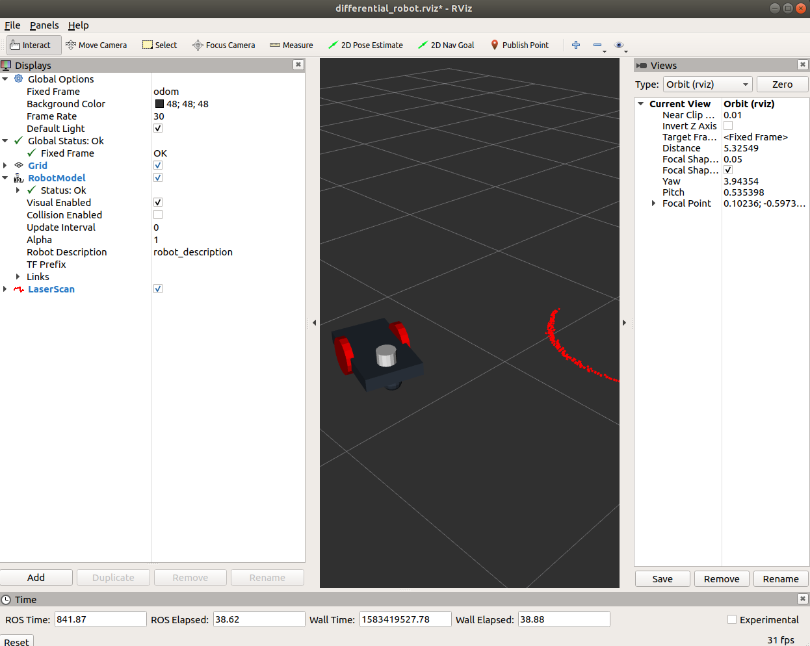
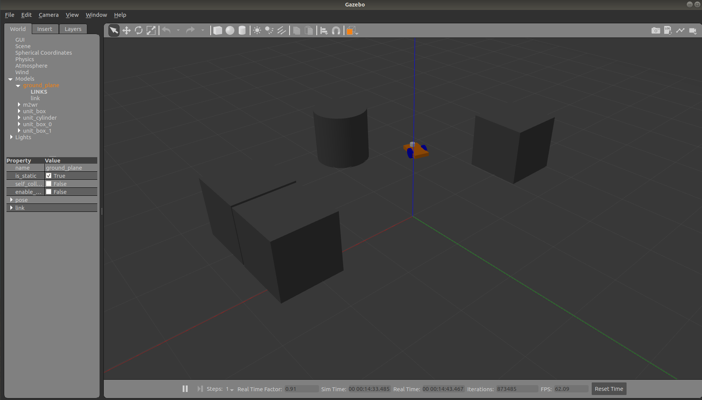

#### **launch an empty world in gazebo simulator**
roslaunch m2wr_description empty_world.launch 
#### **spawn the mobile robot in gazebo simulator**
roslaunch m2wr_description spawn.launch 
#### **display the robot and laser scan in Rviz**
roslaunch m2wr_description rviz.launch 
#### **move the robot around with teleop**
rosrun teleop_twist_keyboard teleop_twist_keyboard.py

